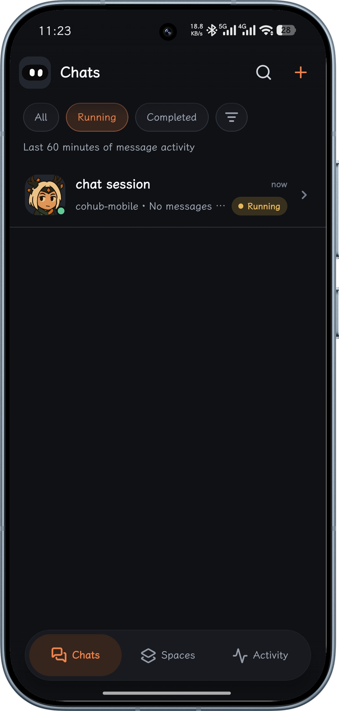
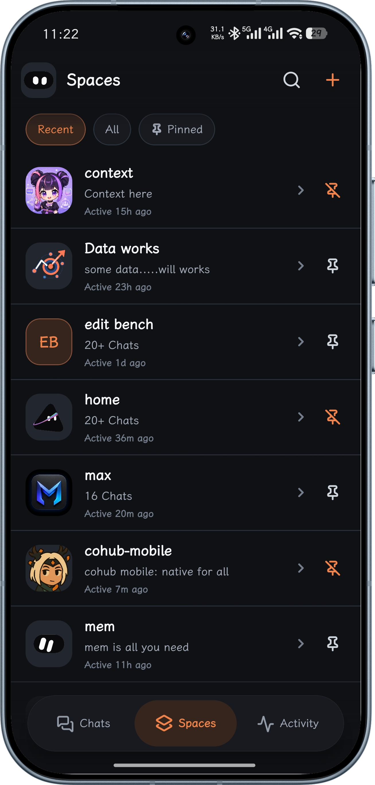
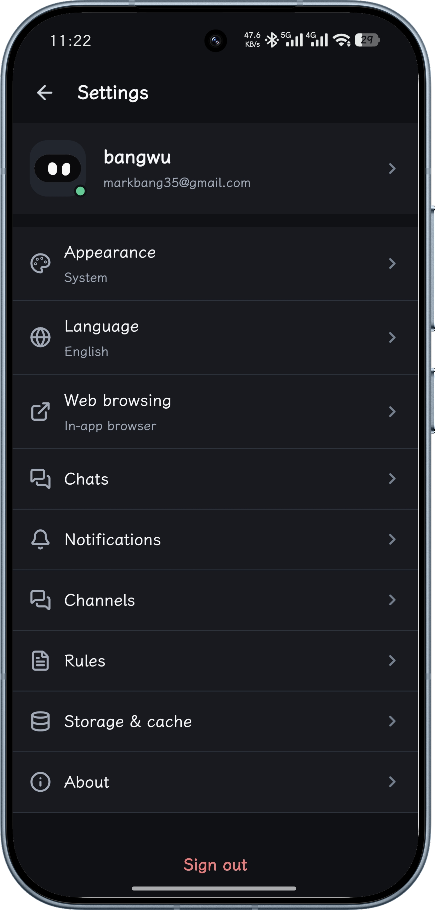

# Cohub Mobile

A native iOS and Android client for Cohub, built with React Native and Expo.

  
  &nbsp;&nbsp;
  
  &nbsp;&nbsp;
  

## Download

| Platform | Link |
|----------|------|
| **Android** | [Download APK](https://cohub.live/bangwu/cohub-mobile/w/download) · [all builds](https://github.com/markbang/cohub-mobile/releases) |
| **iOS** | [Join the TestFlight beta](https://testflight.apple.com/join/KWhztpkP) |

Android builds are published per ABI to the Yaota distribution origin, which is what the in-app updater reads. The [download page](https://cohub.live/bangwu/cohub-mobile/w/download) resolves the newest `arm64-v8a` build, and falls back to GitHub Releases if the catalog is unreachable.

iOS ships through TestFlight while the app is in beta. Install the Apple TestFlight app first, then open the invite link above.

## Included

The app uses native screens for Chats, Spaces, Activity, Profile, session timelines, files, and settings. Published HTML/Work previews are opened in a constrained WebView because their content is inherently web-based.

- Native Chats inbox with paginated cross-Space selection, search, running/attention filters, optimistic sends, stop, rename, attachments, camera, photo library, and live Cohub stream patches
- Turn-based Chat history with older/newer pagination, searchable turn navigation, direct window jumps, and stable scroll position
- Model picker with availability lights, provider/context metadata, and per-model thinking levels
- Native PCM voice input connected to Cohub ASR
- Spaces with Chats, Files, Saves, Works, and Task Runs
- Native file viewer plus constrained WebView for published Works
- Activity and usage overview
- Native Settings sections for Profile, Appearance, Activity, Notifications, Rules, Channels, Billing, and Referrals
- Cache-first SQLite hydration, reconnect reconciliation, and user-scoped cache clearing
- Native Logto PKCE, `cohub://` deep links, notification tap routing, APNs/FCM token acquisition, and GitHub-native build profiles

## Thanks

[Cohub](https://github.com/talesofai/cohub)
